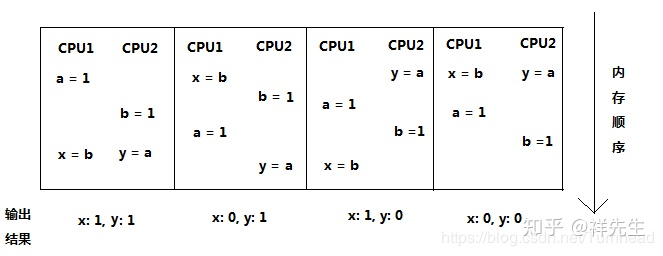
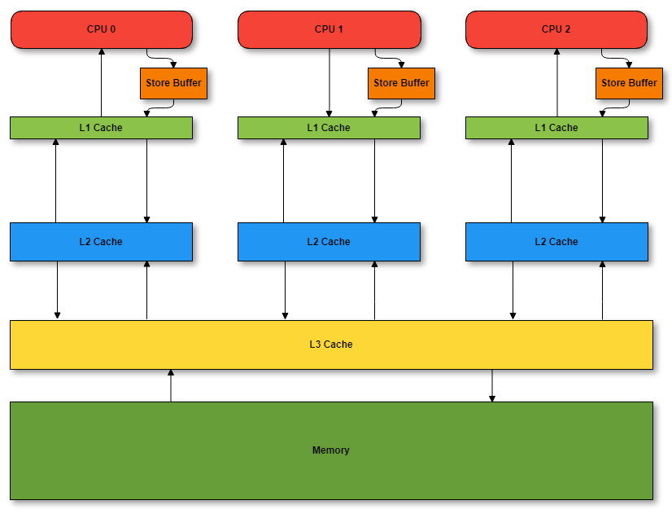

# 序言

抛砖引玉，问题互动

## 通过本次分享你能学到什么

- 重温内存可见性，指令重排序等多线程编程时需考虑的因素
- 机器同情概念 https://mechanical-sympathy.blogspot.com/
- 通过内存布局，熟悉使用Unsafe的底层API
- 了解Disruptor如何利用上述特性实现600万的QPS

## 计算机内存模型与CPU的指令重排序特性

#### 指令重排序
下面这个例子一共有几种可能？

找找Java并发编程实战里的例子
https://tech.meituan.com/2014/09/23/java-memory-reordering.html

#### TSO模型(Total Store Ordering)与JVM提供的四种内存屏障

#### volatile实现原理（拓展）

##### 内存屏障

编译器和处理器必须同时遵守重排规则。由于单核处理器能确保与“顺序执行”相同的一致性，所以在单核处理器上并不需要专门做什么处理就可以保证正确的执行顺序。 但在多核处理器上通常需要使用内存屏障(Memory Barrier)
这种特殊指令来确保这种一致性。

##### 缓存行

Cache是由很多个cache line组成的。 每个cache line通常是64字节，并且它有效地引用主内存中的一块儿地址。 一个Java的long类型变量是8字节，因此在一个缓存行中可以存8个long类型的变量。
CPU每次从主存中拉取数据时，会把与目标数据相邻的数据存入同一个cache line。 和某些机械硬盘即便你的指令读取的数据只有1字节但它每次还是会读512个字节同理。
在访问一个long数组的时候，如果数组中的一个值被加载到缓存中，它会自动加载另外7个。因此你能非常快的遍历这个数组。

## Disruptor的高性能密码

#### 解决伪共享(False Share)导致的性能损耗

##### 伪共享产生的原因

##### 代码验证伪共享导致的性能下降

#### 环形数组这种顺序性数据结构充分利用了缓存行带来的性能红利

```java
public class CacheLineEffect {
    //考虑一般缓存行大小是64字节，一个 long 类型占8字节
    static long[][] arr;

    public static void main(String[] args) {
        arr = new long[1024 * 1024][];
        for (int i = 0; i < 1024 * 1024; i++) {
            arr[i] = new long[8];
            for (int j = 0; j < 8; j++) {
                arr[i][j] = 0L;
            }
        }
        long sum = 0L;
        long marked = System.currentTimeMillis();
        for (int i = 0; i < 1024 * 1024; i += 1) {
            for (int j = 0; j < 8; j++) {
                sum = arr[i][j];
            }
        }
        System.out.println("Loop times:" + (System.currentTimeMillis() - marked) + "ms");

        marked = System.currentTimeMillis();
        for (int i = 0; i < 8; i += 1) {
            for (int j = 0; j < 1024 * 1024; j++) {
                sum = arr[j][i];
            }
        }
        System.out.println("Loop times:" + (System.currentTimeMillis() - marked) + "ms");
    }
}
```

#### 在关键点插入屏障实现无锁设计

## Disruptor的设计实现

#### 无锁序列 Sequence

#### 只有一个指针的环形数组

#### 二阶段提交

- 利用缓存行得到的性能提升
- 多线程下缓存伪共享问题
- 代码验证伪共享导致的性能下降
- 伪共享导致的性能问题
- 环形数组在Disruptor中的应用，与利用缓存行得到的性能提升
- 实现无锁序列，内存屏障与CAS在Disruptor中的应用

####


## Disruptor的应用
