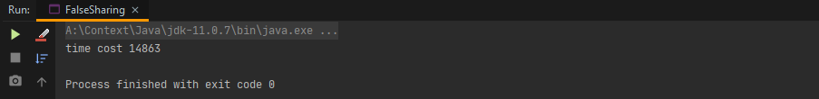

# 序言

抛砖引玉，问题互动
不讨论细节，细节是实际执行要解决的问题，这里只提供思路

# 通过本次分享你能学到什么

- 重温内存可见性，指令重排序等多线程编程时需考虑的因素
- 机器同情概念 https://mechanical-sympathy.blogspot.com/
- 通过内存布局，熟悉使用Unsafe的底层API
- 了解Disruptor如何利用上述特性实现600万的QPS

# 计算机内存模型与CPU的指令重排序特性

#### 指令重排序
在日常工作里也是有重排序的，任务有多个当然优先做简单的或沟通成本低的

下面这个例子一共有几种可能？

找找Java并发编程实战里的例子
https://tech.meituan.com/2014/09/23/java-memory-reordering.html

#### TSO模型(Total Store Ordering)与JVM提供的四种内存屏障

#### 内存屏障

编译器和处理器必须同时遵守重排规则。由于单核处理器能确保与“顺序执行”相同的一致性，所以在单核处理器上并不需要专门做什么处理就可以保证正确的执行顺序。 但在多核处理器上通常需要使用内存屏障(Memory Barrier)
这种特殊指令来确保这种一致性。

#### 缓存行

Cache是由很多个cache line组成的。 每个cache line通常是64字节，并且它有效地引用主内存中的一块儿地址。 一个Java的long类型变量是8字节，因此在一个缓存行中可以存8个long类型的变量。
CPU每次从主存中拉取数据时，会把与目标数据相邻的数据存入同一个cache line。 和某些机械硬盘即便你的指令读取的数据只有1字节但它每次还是会读512个字节同理。
在访问一个long数组的时候，如果数组中的一个值被加载到缓存中，它会自动加载另外7个。因此你能非常快的遍历这个数组。
##### 利用缓存行带来的性能提升

执行结果

## Disruptor的高性能密码

##### 伪共享产生的原因
两个变量在同一缓存行，变量X被修改会设整个缓存行被设为无效，由于缓存的最小单位是就是缓存行，所以此举会引发另一个与X变量无关的线程的缓存过期，导致性能损耗。
如果Core1一直修改X而Core2一直修改Y就会导致两个核心的缓存不断被对方设为无效，需要重新加载，如图中所示。

##### 代码验证伪共享导致的性能下降
真的假的？这种损耗很严重吗？我不管他是不是也无所谓? 反正我是个不在乎细节的人。

测试代码:

测试结果:

未解决伪共享的版本

解决伪共享的版本

5倍性能差距

#### Disruptor如何解决伪共享(False Share)导致的性能损耗?
神奇的内存填充!

#### 环形数组
##### 环形数组这种顺序性数据结构充分利用了缓存行带来的性能红利

##### 环形数组的普遍应用场景适合做什么
如果你在做消息推送的时候需要做失败重推你会用什么数据结构来存储你将要推送的数据?
环形数组可以实现：
将环形数组初始化为N，
设F代表数组内推送失败消息数
N表示最多可以容忍N个推送失败的消息，如果F > N会导致环形数组被非法覆写，此时应触发饱和策略(丢弃 or 阻塞 or 等待N秒?)

redis主从同步时，master与slaver通信所使用的消息储存结构就是环形数组
源码实现地址:
https://github.com/redis/redis/blob/unstable/src/replication.c#L28

#### 在关键点插入内存屏障保证可见性，避免过多的缓存同步

## Disruptor的设计实现

#### 无锁序列 Sequence

#### 利用无锁序列实现只有一个指针的环形数组

#### 二阶段提交

- 利用缓存行得到的性能提升
- 多线程下缓存伪共享问题
- 代码验证伪共享导致的性能下降
- 伪共享导致的性能问题
- 环形数组在Disruptor中的应用，与利用缓存行得到的性能提升
- 实现无锁序列，内存屏障与CAS在Disruptor中的应用

####

## Disruptor的应用

##参考
[高性能队列——Disruptor - 美团技术团队](https://tech.meituan.com/2016/11/18/disruptor.html)

[Mechanical Sympathy For False Sharing](https://mechanical-sympathy.blogspot.com/2011/07/false-sharing.html)
