# 计算机内存模型

### TSO模型(Total Store Ordering)与JVM提供的四种内存屏障

读: 私有的storebuffer是否命中，如果没命中则查找cache

写: 写入storebuffer，如果sb满了或遇到同步指令才真正写入内存,写入操作保证FIFO顺序

### 内存屏障

一个代码例子
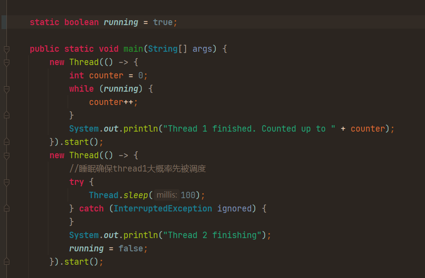

执行结果:

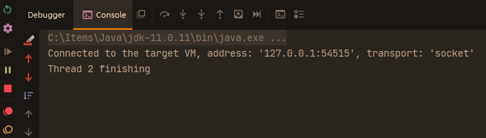

### 缓存行

Cache是由很多个cache line组成的。 每个cache line通常是64字节，并且它有效地引用主内存中的一块儿地址。 一个Java的long类型变量是8字节，因此在一个缓存行中可以存8个long类型的变量。
CPU每次从主存中拉取数据时，会把与目标数据相邻的数据存入同一个cache line。 和某些机械硬盘即便你的指令读取的数据只有1字节但它每次还是会读512个字节同理。
在访问一个long数组的时候，如果数组中的一个值被加载到缓存中，它会自动加载另外7个。因此你能非常快的遍历这个数组。

可以看到，虽然我们从用户角度确实是只读了1个字节（开篇的代码中我们只给这次磁盘IO留了一个字节的缓存区）。
但是在整个内核工作流中，最小的工作单位是磁盘的扇区，为512字节，比1个字节要大的多。
另外block、page cache等高层组件工作单位更大，所以实际一次磁盘读取是很多字节一起进行的。
假设段就是一个内存页的话，一次磁盘IO就是4KB（8个512字节的扇区）一起进行读取。

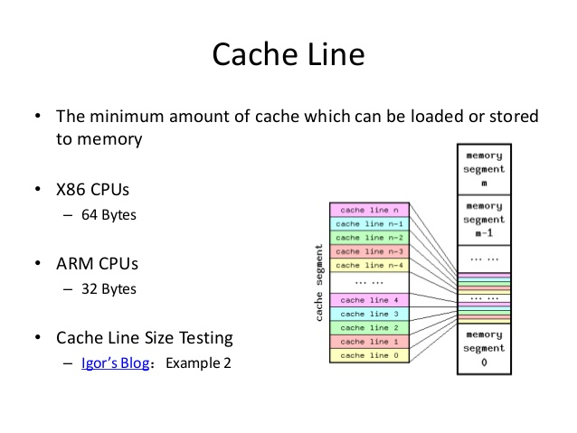

##### 利用缓存行带来的性能提升

执行结果

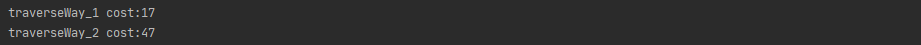

## Disruptor的高性能密码

##### 伪共享产生的原因

两个变量在同一缓存行，变量X被修改会设整个缓存行被设为无效，由于缓存的最小单位是就是缓存行，所以此举会引发另一个与X变量无关的线程的缓存过期，导致性能损耗。
如果Core1一直修改X而Core2一直修改Y就会导致两个核心的缓存不断被对方设为无效，需要重新加载，如图中所示。

##### 代码验证伪共享导致的性能下降

N个线程读一个N大小的数组，每个线程循环读同一个位置并修改该位置的数据

测试代码:

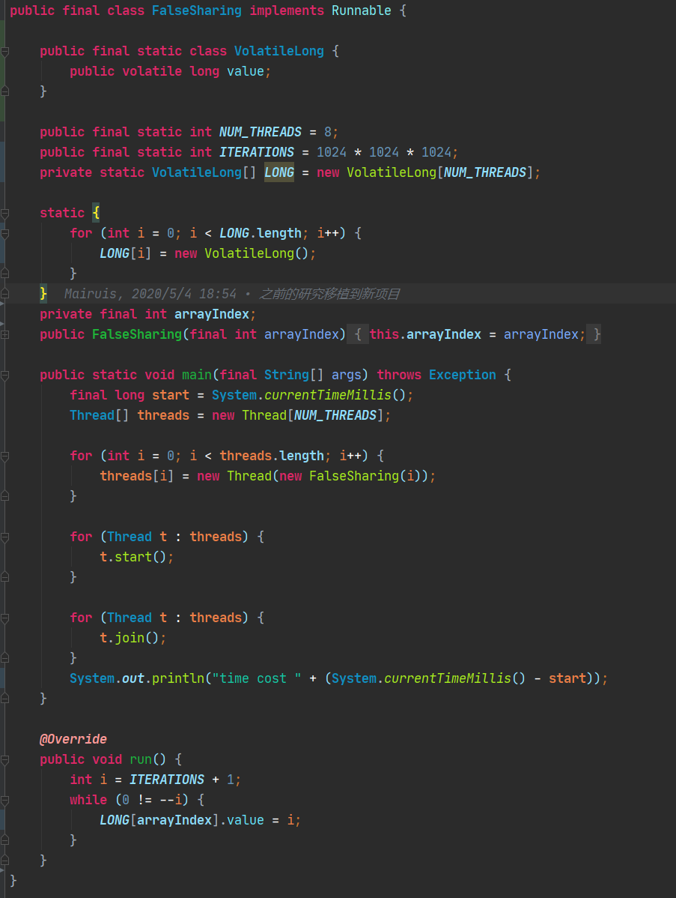

测试结果:

未解决伪共享的版本

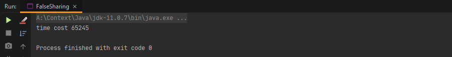

解决伪共享的版本

5倍性能差距

#### Disruptor如何解决伪共享(False Share)导致的性能损耗?

神奇的内存填充!

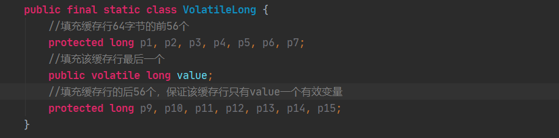

#### 环形数组

##### 环形数组这种顺序性数据结构充分利用了缓存行带来的性能红利

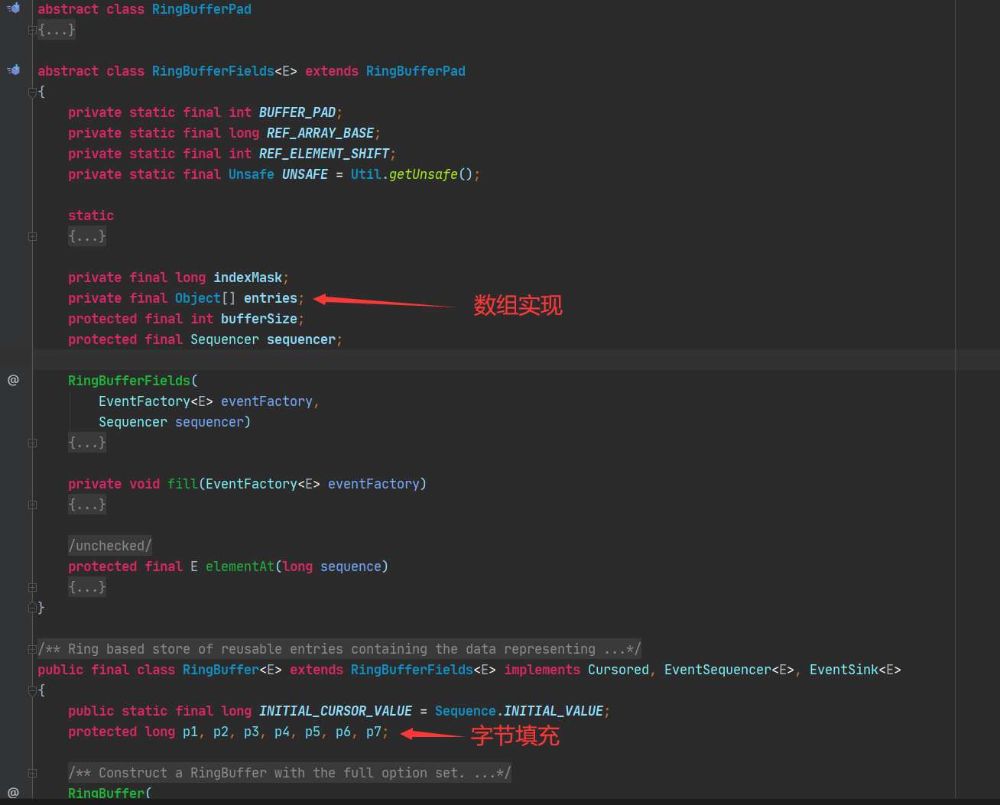

##### 环形数组的普遍应用场景

如果你在做消息推送的时候需要做失败重推你会用什么数据结构来存储你将要推送的数据? 环形数组可以实现： 将环形数组初始化为N， 设F代表数组内推送失败消息数 N表示最多可以容忍N个推送失败的消息，如果F >
N会导致环形数组被非法覆写，此时应触发饱和策略(丢弃 or 阻塞 or 等待N秒?)

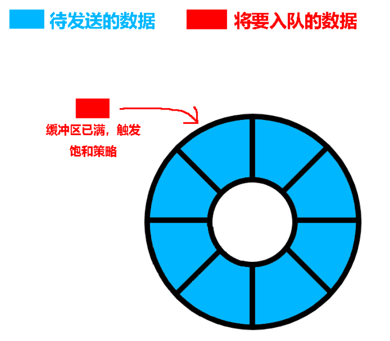

redis主从同步时，master与slaver通信所使用的消息储存结构就是环形数组 源码地址:
https://github.com/redis/redis/blob/unstable/src/replication.c#L28

#### 在关键点插入内存屏障保证可见性，避免过多的缓存同步

#### 只有一个指针的环形数组

如何保证环数据不被覆盖 如何实现高性能索引 如何实现无GC

#### 无锁序列 Sequence 实现无锁事务Id自增，同时增加内存填充防止伪共享

内存填充 + CAS自增Id,实现无锁 解决伪共享问题

## Disruptor的数据递交设计实现

#### 各种组合模型

P -> C

P -> C1,C2,C3

#### 两端不同的并发模型

单生产者单消费者情况

单P情况:
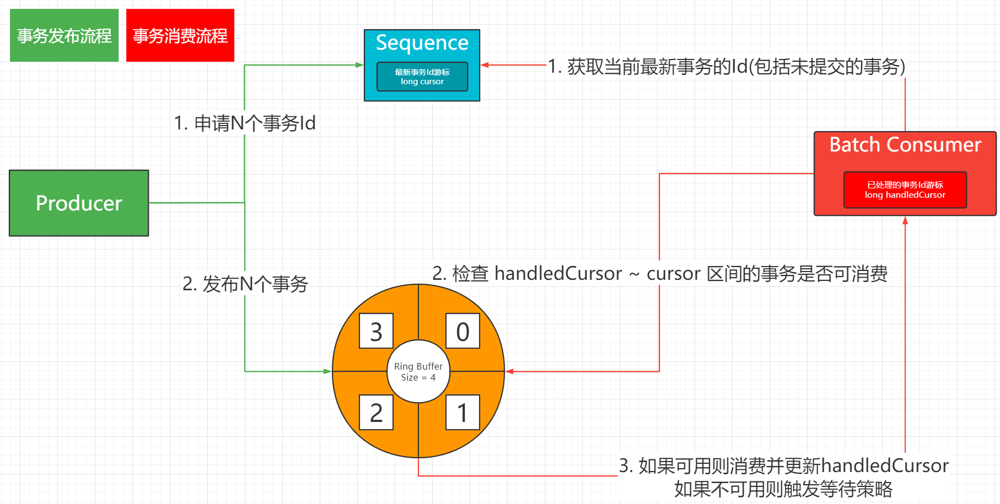

1.第一阶段 申请N : 将线程本地缓存的next + N个事务号

2.第二阶段 发布N : 将Sequence事务号setVolatile到next + N

多P情况

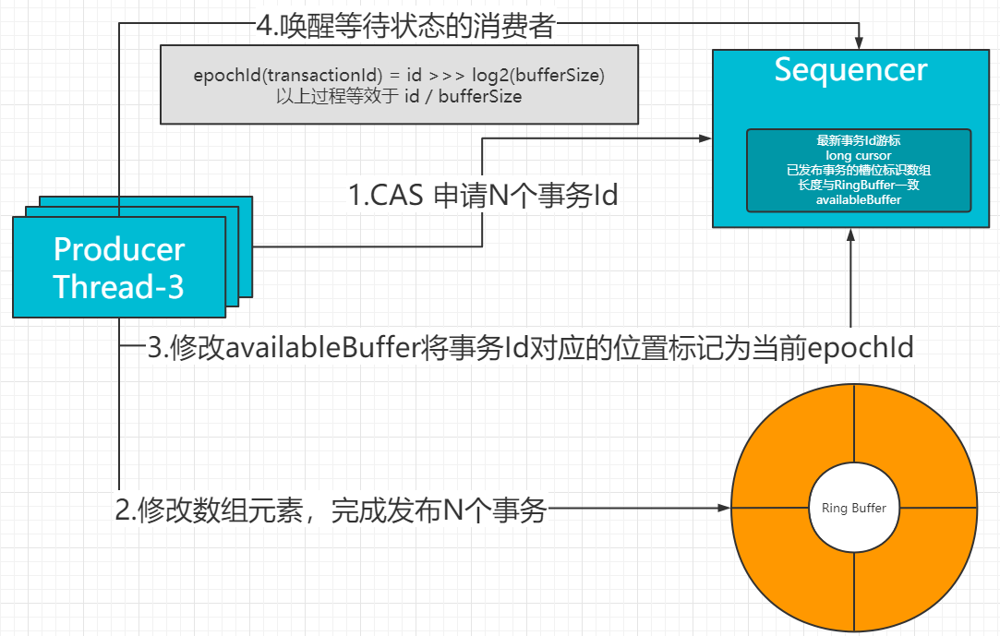

1.第一阶段 申请N : 将Sequence事务号setVolatile到next + N,

2.第二阶段 发布N : 将事务id所对应的availableBuffer标记为当前的圈数 epochId

单线程C情况：

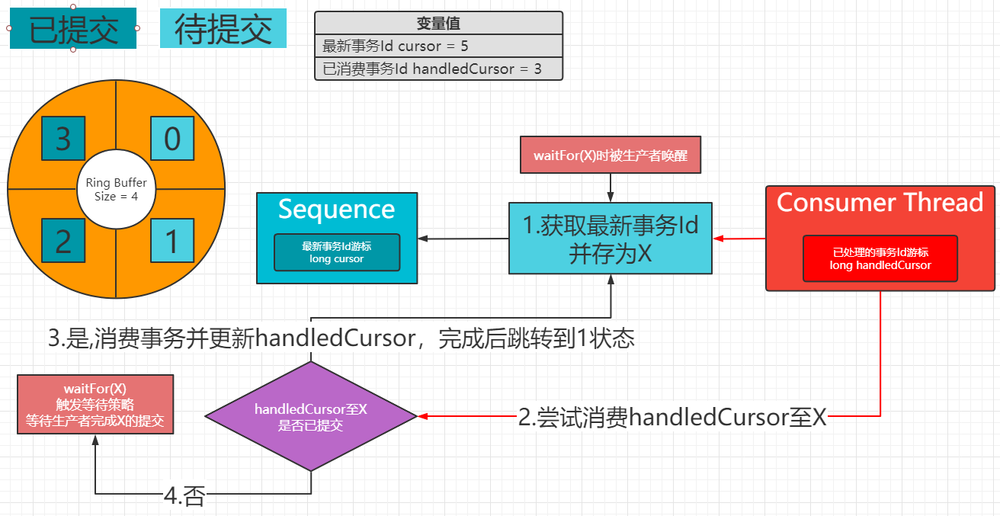

多线程C情况：

## Disruptor的应用

#### logback

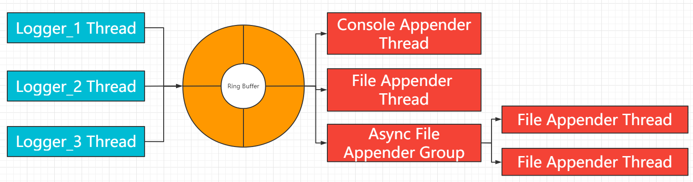

## 引用文章

[高性能队列——Disruptor - 美团技术团队](https://tech.meituan.com/2016/11/18/disruptor.html)

[Mechanical Sympathy For False Sharing](https://mechanical-sympathy.blogspot.com/2011/07/false-sharing.html)

[Advanced Operating Systems COMP9242 2002/S2 ](http://www.cse.unsw.edu.au/~cs9242/02/lectures/10-smp/node8.html)